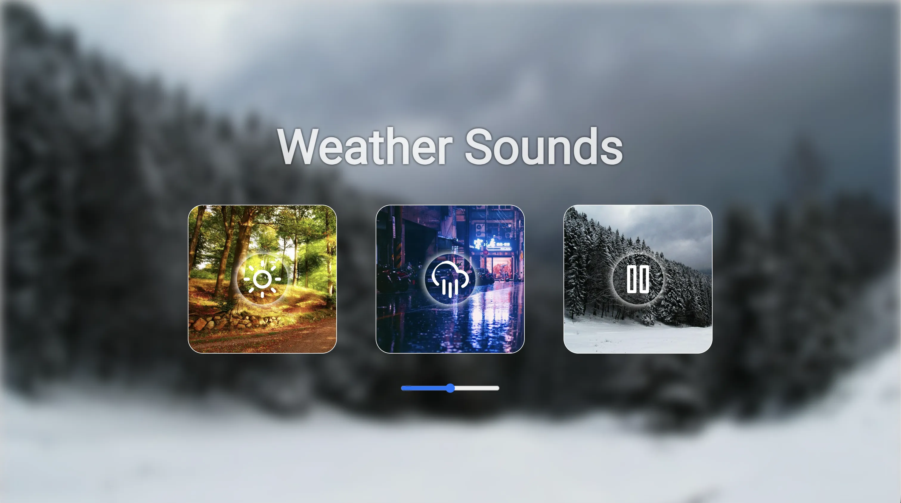

# Weather Sounds

Приложение для воспроизведения шумов природы с настраиваемой громкостью, переключением звуков и динамическими фонами. Реализовано на TypeScript с Webpack-сборкой для development и production.

## Демо

🟢 **Live:** [https://weather-sounds-32bd1.web.app/](https://weather-sounds-32bd1.web.app/)



## Функционал

- 🔊 **Три вида шумов природы**: дождь (rain), летние звуки леса (summer), зимние звуки леса (winter)
- 🎚️ Регулятор громкости для всех звуков
- ⏯️ Toggle-воспроизведение: повторное нажатие на кнопку ставит звук на паузу, следующее — возобновляет
- 🖼️ Динамические фоны: rainy-bg.webp, summer-bg.webp, winter-bg.webp
- 📱 Responsive дизайн
- 🔇 Автоматическое выключение предыдущего звука при выборе нового

## Установка и запуск

```bash
# Клонировать репозиторий
git clone https://github.com/rayonnant/weather-sounds
cd weather-sounds

# Установить зависимости
npm install

# Development режим с автообновлением
npm start

# Сборка для production
npm run build

# Development сборка
npm run build:dev

# Проверка кода (ESLint)
npm run lint


